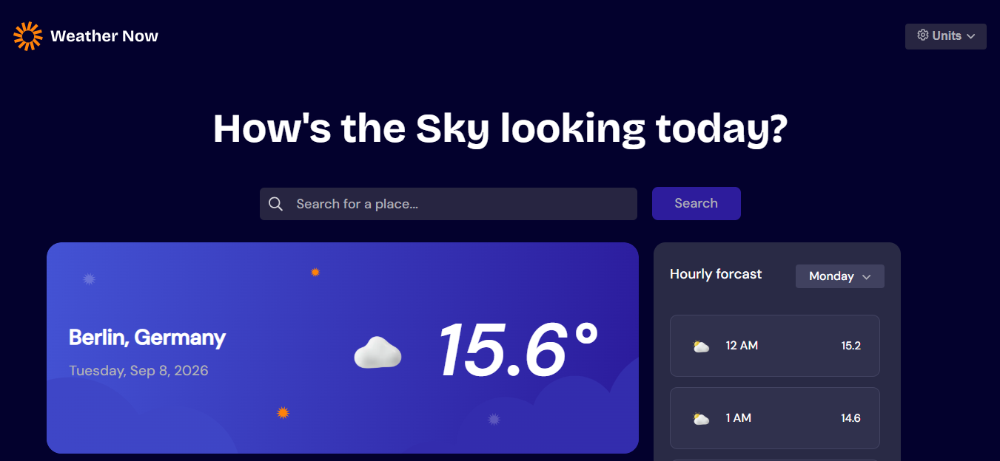

# Frontend Mentor - Weather app solution

This is a solution to the [Weather app challenge on Frontend Mentor](https://www.frontendmentor.io/challenges/weather-app-K1FhddVm49). Frontend Mentor challenges help you improve your coding skills by building realistic projects.

## Table of contents

- [Overview](#overview)
  - [The challenge](#the-challenge)
  - [Screenshot](#screenshot)
  - [Links](#links)
- [My process](#my-process)
  - [Built with](#built-with)
  - [What I learned](#what-i-learned)
  - [Continued development](#continued-development)
  - [Useful resources](#useful-resources)
  - [AI Collaboration](#ai-collaboration)
- [Author](#author)
- [Acknowledgments](#acknowledgments)

## Overview

### The challenge

Users are able to:

- Search for weather information by entering a location in the search bar, with live autocomplete suggestions pulled from the Open-Meteo geocoding API
- View current weather conditions including temperature, a matching weather icon, and location details (city, region, country)
- See additional weather metrics: "feels like" temperature, humidity percentage, wind speed, and precipitation amount
- Browse a 7-day forecast with daily high/low temperatures and weather icons
- View an hourly forecast, filterable by day of the week via a dropdown, in a scrollable container
- Toggle between Celsius/Fahrenheit, km/h/mph, and mm/inches via the units dropdown, with the choice re-fetching live data in the selected units
- See dedicated states for loading (skeleton placeholders), API errors (with a working Retry button), and no search results found

### Screenshot



### Links

- Solution URL: [Add solution URL here](https://your-solution-url.com)
- Live Site URL: [Add live site URL here](https://your-live-site-url.com)

## My process

### Built with

- Semantic HTML5 markup
- CSS custom properties
- Flexbox
- CSS Grid
- Mobile-first workflow
- [React](https://reactjs.org/) - JS library
- [Vite](https://vitejs.dev/) - Build tool and dev server
- [Open-Meteo API](https://open-meteo.com/) - Free geocoding and weather forecast data, no API key required
- [Vitest](https://vitest.dev/) - Unit and component testing
- [React Testing Library](https://testing-library.com/docs/react-testing-library/intro/) - Component testing utilities

### What I learned

This project was my first time fetching and shaping real API data inside React, and most of what I learned centers on that.

**Parallel arrays vs. arrays of objects.** Open-Meteo's `hourly` and `daily` responses come back as separate, index-aligned arrays rather than a ready-made array of objects. I learned to walk them together with `.map((value, index) => ...)`, pulling the matching entry out of each array by that same index:

```js
function buildHourlyList(hourly) {
  return hourly.time.map((t, index) => ({
    time: new Date(t).toLocaleTimeString('en-US', { hour: 'numeric', hour12: true }),
    degree: hourly.temperature_2m[index],
    code: hourly.weather_code[index],
    id: index,
    date: new Date(t).toLocaleDateString('en-US', { weekday: 'long' })
  }));
}
```

**Safe access with optional chaining.** Since `weather` starts as `null` before the first fetch resolves, reading `weather.current.temperature_2m` directly would crash on the very first render. `weather?.current?.temperature_2m` returns `undefined` instead, which React renders as nothing until real data arrives.

**Lifting state up.** `location`, `units`, and the fetched `weather` all needed to be shared across `Header`, `SubHeader`, and `MainPage`, which don't otherwise know about each other. Moving that state into the parent `Homepage` component, and passing data down as props with callbacks passed down to update it, was the pattern that made the three components work together.

**Updating one field of a state object safely:**

```js
function handleUnitChange(key, value) {
  setUnits(prev => ({ ...prev, [key]: value }));
}
```

**Debouncing search input** with `useRef` to hold the pending timer ID, so that only the last keystroke in a burst of typing actually triggers a geocoding request instead of firing one request per keystroke.

**`try`/`catch` around the fetch**, so a failed request sets an error flag instead of leaving the UI stuck or crashing, and `setIsLoading(false)` sits outside both the `try` and `catch` blocks so the loading state always clears, success or failure.

**Testing pure functions vs. components.** Vitest alone was enough to test `buildHourlyList`/`buildDailyList` as plain input-in/output-out functions. Testing an actual rendered component (`Header`) needed React Testing Library on top, plus a `jsdom` test environment and a setup file importing `@testing-library/jest-dom` so matchers like `.toBeInTheDocument()` were available.

### Continued development

- Write component tests for interactive behavior (e.g. does clicking the Units button actually open the dropdown, does an empty search-and-submit show the warning message) using `fireEvent` from React Testing Library
- Expand the weather-code-to-icon lookup table for full WMO code coverage, beyond the fallback icon currently used for less common codes
- Look into real dynamic routing (e.g. `/city/:name` URLs) as a separate concept from the conditional rendering used for loading/error/empty states

### Useful resources

- [Open-Meteo API docs](https://open-meteo.com/en/docs) - The interactive parameter builder made it possible to construct and verify request URLs without memorizing every query parameter name.

### AI Collaboration

I used Claude (Anthropic) throughout this project, specifically asking it to teach rather than write the code for me.

- Claude explained concepts (APIs and query strings, `fetch`/`async`/`await`, `useState`/`useEffect`, optional chaining, debouncing, `try`/`catch`, parallel-array data, and setting up Vitest/React Testing Library) with plain-language explanations and small isolated examples before connecting them to my actual code.
- For each feature, Claude asked me to write the code myself first, then reviewed what I wrote, pointed out specific mismatches or bugs without directly fixing them, and had me correct them.
- This worked well for building real understanding of *why* each piece of code was needed, not just what to type. It also caught a number of subtle bugs I introduced myself (typos in query parameter names, mismatched dependency arrays, functions called with the wrong arguments) by walking through actual error messages and API responses rather than guessing.
- The main place I asked Claude to just write the code directly, rather than teach it, was this README.

## Author

- Frontend Mentor - [@Wizdev0](https://www.frontendmentor.io/profile/Wizdev0)
- Twitter - [@otutech](https://www.twitter.com/otutech)
- Email: [otuwewisdom01@gmail.com](mailto:otuwewisdom01@gmail.com)

## Acknowledgments

Built with guidance from Claude (Anthropic) as a learning exercise.